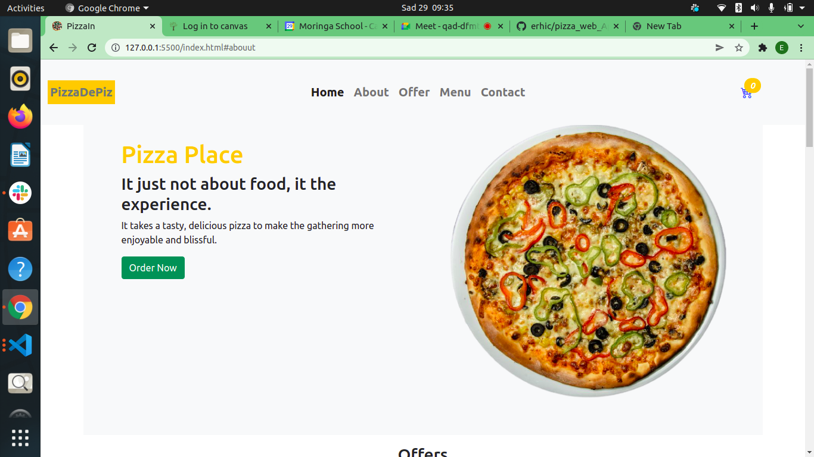

# Delani Studio

### Author:  [Eric N](https://github.com/erhic/pizza_web_App)

### Description
----
    This is a online pizza ordering website, offering delivery services for pizza on order.

 ### Design

### Technologies Used
----
- HTML
- CSS
- JS
- BOOTSTRAP
- JQUERY

### Installion Process
----
* To run the application ,the required tools required is mainly a browser application example like google chrome and access to the internet. To access the aplication online click (https://github.com/erhic/pizza_web_App).
The application can run a mobile device or a computer.

* To use the application offline in your local device;
*Create a folder in you local device the proceed and clone the site using the link (git clone git@github.com:erhic/pizza_web_App.git)
### Bug
----
There is no identified bug.

### Contacts
----
For feedback or any information pertaining this project feel free to reach me through :

Email: ericgichovi@moringa.student.com

### Licence 
---

[ LICENCE](LICENSE) 
 (link to MIT License )

